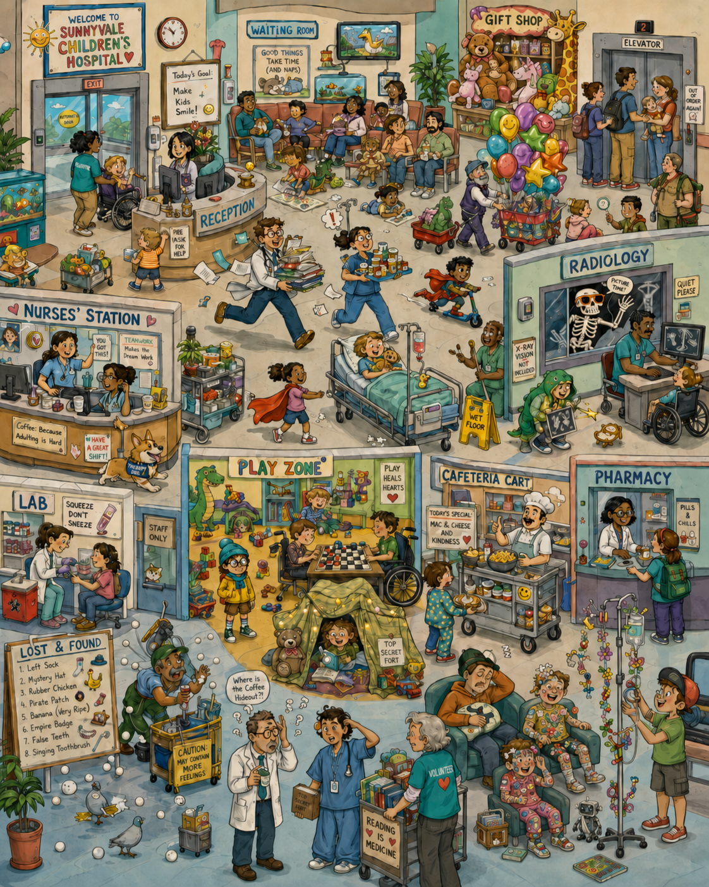
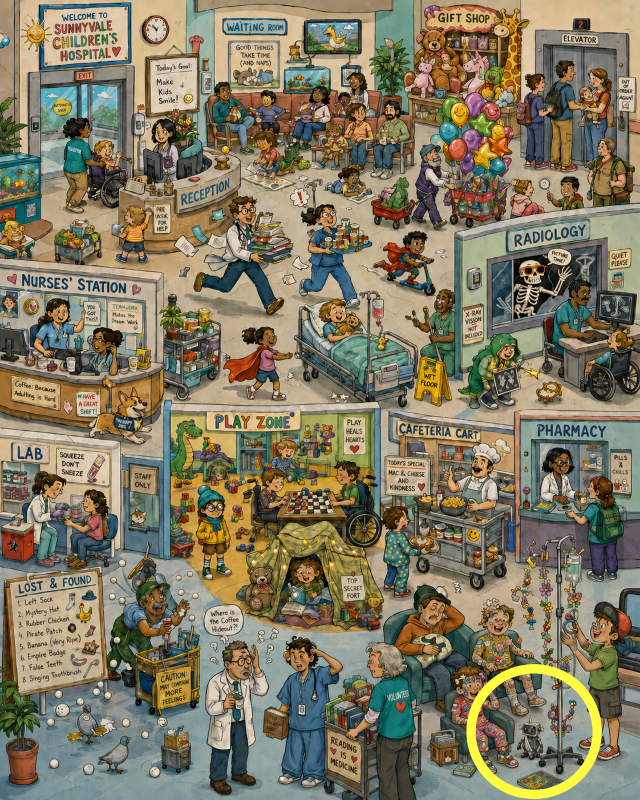

{.preview-image fig-align="center"}

## Introduction

A common complaint I hear from physician colleagues about AI is some version of "I see the potential, but I don't know how to make it useful in my work." They may have played with a chat interface, composed a poem, and tried a few medical queries, but these experiences don't translate into practical next steps to improve their specialized, professional work. The key question is: How can medical professionals build workflows that take advantage of AI?

## Verification > Generation

My first recommendation is to look for ways to exploit a huge leverage point: *verification is faster than generation*.

To explain, let's start with an example. Try to find the injured robot in the image. When you're done, click the line below for the answer.

{.lightbox fig-align="center" width="400"}

**Click for the answer.**

{.lightbox fig-align="center" width="400"}

How long did the searching take? It required you to scan the page with your eyes and expend energy recognizing objects and tracking your visual path across the image. All of this activity to generate an answer induced a cost in time, energy, and attention.

When you clicked for the answer, I gave you a nice indicator. Your attention easily found the circle and readily recognized an injured robot. Verification of the answer I gave allowed you to avoid the temporal and metabolic effort required for you to generate the answer yourself.

Generation is slow. Verification is fast. AI is good at producing and bad at knowing what you want. So the leverage is in tasks where you can check the output quickly. The minute you can verify the result faster than you can build it from scratch, the entire economics of the task change.

This is why code became the first killer app for AI. Code has built-in verification. It runs, or it doesn't. A developer can ask an AI for a function and find out in seconds whether the function does what was asked. The cycle is short, the feedback is honest, and the gains compound.

Medicine is full of tasks with the same structure. Ask AI to draft a prior authorization appeal, and you can scan it in thirty seconds because you already know the criteria the insurer wants addressed. Ask for patient discharge instructions at a sixth grade reading level, and you can spot a dosing error or a missing red flag symptom at a glance because you wrote the orders. Ask for a differential on a case you have already worked up, and you can immediately judge whether the reasoning holds because you know the answer. In each case, generating the document from scratch would take twenty minutes. Verifying it takes two. You are not delegating your judgment. You are spending it where it is cheap and fast, on checking rather than typing.

## You must know what you want

The hidden precondition to leverage this advantage is that you have to know what is correct. People who struggle with AI most often struggle here. They want "something good" but cannot say what good looks like. AI obligingly produces something, but the person cannot evaluate it confidently, and the whole exercise feels like work without acceleration. However, if you know what is correct output, then verification is possible, and progress starts to stick.

Knowledge work has always required verification, but standards are often implicit instead of automated. A slide deck needs verification: does it cover the right arguments, in the right order, with the right examples? A technical document needs verification: are the claims accurate, the citations real, the logic intact? An email requires verification: does it say what I meant in the tone I meant? A teaching outline needs verification: does it actually communicate the concepts to someone who does not yet understand them?

## Start verifying!

So if you're an expert stuck at "what's next", a practical first move is to find one task this week that has clear standards for success. Draft a patient letter where you already know the three points it must make. Try the ambient scribe your hospital licensed but you have never opened, and check the note against what you remember from the visit. Build a lecture outline on a topic you have taught before, where you can list the key concepts in advance. Summarize a paper for journal club that you have already read closely. Run that task through whatever AI tool you can safely use. Notice where your effort went. Did most of it go toward reading and deciding rather than producing? Did you save time? If so, you have crossed the on-ramp.

You will feel the same gap you felt looking for the injured robot. Searching cost time and attention. Verifying cost a glance. That is the asymmetry AI hands you on any knowledge-work task where you already know what correct looks like. Verification is faster than generation.
