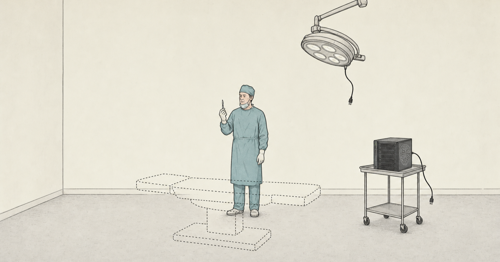
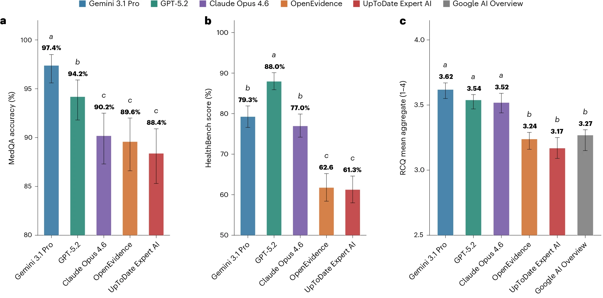

## Introduction

{fig-align="center"}

A new [*Nature Medicine* paper](https://www.nature.com/articles/s41591-026-04431-5) compared two specialized clinical AI tools, OpenEvidence and UpToDate Expert AI, with several frontier general-purpose models [@vishwanath2026general]. The headline result was hard to miss: the frontier models performed better across medical benchmarks and blinded clinician ratings of real clinical queries.

{fig-align="center"}

The results have been entertaining to watch. [Eric Topol’s X post](https://x.com/EricTopol/status/2065430578997203374) helped ignite the debate. [OpenEvidence pushed back](https://x.com/EvidenceOpen/status/2065941574648009008). Others pointed out real limitations in both directions: benchmark design is hard, proprietary systems are hard to evaluate, and clinical usefulness is not the same thing as a leaderboard score.

Now I do not think the paper settles the future of clinical AI. Scoring the quality of model output is hard, and this paper evaluates an extremely narrow slice of the many ways people might use a clinical AI system. So there are no definitive conclusions here.

However, I do think the findings support a useful framing for those who are building clinical AI systems: the bitter lesson is true-ish for medicine.

## The bitter lesson is true-ish for medicine

### True

Richard Sutton’s bitter lesson is that general methods powered by computation tend to beat expert-crafted systems as scale increases [@sutton2019bitter]. In clinical AI, that seems increasingly plausible. Frontier models did not become good at medical questions because they were engineered around a particular specialty workflow or knowledge base, like OpenEvidence or UTD AI. They became good because broad training, scale, tool use, and general reasoning improved.

That is the “true” part.

### Ish

The “ish” is more important.

The value of clinical AI is only realized when the model interacts with the real, messy world of healthcare. This interaction requires well-designed infrastructure to ensure it is safe, effective, and beneficial.

A powerful general model is just one component of this system. Medicine needs expert-crafted machinery around the model, such as governance, audit trails, workflow integration, retrieval, citation standards, monitoring, escalation rules, input controls, output controls, and a sharply limited action surface. The bitter lesson says general models may keep getting better. It does not say we can skip the work required to make them safe, useful, and accountable.

That should be encouraging for people building clinical AI infrastructure. The durable asset is not the model itself. Models will come and go. It may be OpenEvidence in one setting, Gemini in another, Claude in another, and an institutionally hosted model somewhere else. Headlines will crown a new AI champion every few months. The durable asset is the harness, the infrastructure that lets a model act safely in the real world. It is the clinical workflow that defines what the model can see, what it can do, how its claims are checked, when a human must intervene, and who is responsible for the result. A surgeon without an operating room is just a person who knows where to cut, and a frontier model without proper infrastructure is just an algorithm that knows what to say.

So the practical lesson is not “frontier models win, specialized tools lose.” That is too simple. The lesson from the bitter lesson is to build for model churn. Assume increasingly capable general models will keep arriving. Then build the clinical infrastructure that can use those models as safe references, swap them when better evidence appears, and keep the responsibility where it belongs.

The bitter lesson may be true-ish. The boring infrastructure lesson is definitely true.
